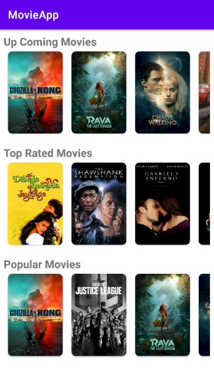
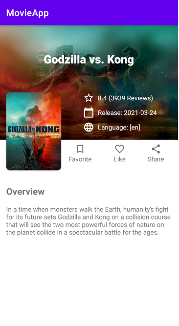

# MovieApp
Application with a clean architecture this built with
 - MVVM
 - Extension Functions
 - Retrofit
 - Navigation Components
 - ViewBinding
 - Coroutines 
 
 # Get in Google Play
 
  
 https://play.google.com/store/apps/details?id=ar.com.mymovies
 
 # Screen

